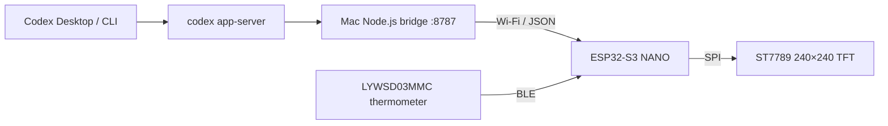

# Codex Usage Widget

**English** | [简体中文](README.zh-CN.md)

A desktop Codex status display built with an ESP32-S3 NANO and a 1.54-inch ST7789 TFT. Track weekly usage, active tasks, and room conditions; enjoy a graffiti-style **HH:MM:SS flip clock** when your tasks are done.


*AI-generated product concept render of the updated clock interface. The animation preview below is generated from the firmware drawing code; neither image is a photograph of the running device.*


The seconds card flips every second. The hour and minute cards join in when their values change. Each flip takes about **650 ms**: the old upper half folds toward the hinge, then the new lower half unfolds with changing shading. Frames are composed in memory before reaching the display. Bridge requests run in a background task so HTTP timeouts do not freeze the clock.


## Features

- Weekly Codex usage, reset countdown, and available reset credits.
- Active task count and up to two real task titles, including common Simplified Chinese characters.
- Three paired flip cards for hours, minutes, and seconds, with pink and lime graffiti numerals.
- Automatic switching between the task dashboard, idle clock, and offline clock.
- Temperature and humidity from an optional Xiaomi `LYWSD03MMC` BLE thermometer.
- Wi-Fi setup and later configuration from a browser, with settings saved in NVS.
- A macOS background service that waits for external project volumes and the configured proxy at login.
- Printable enclosure files and a local 3D viewer with mesh diagnostics, assembly inspection, and collision simulation.

The hardware has been tested with an **ESP32-S3 NANO with 16 MB flash and 8 MB PSRAM**, and a **240×240 ST7789 SPI display**. The setup guide below targets macOS.

## Recent changes

| Area | Current behavior |
| --- | --- |
| Flip clock | HH:MM:SS replaces the four-digit HH:MM layout; actual half-page projection replaces the old covering-band transition. |
| Rendering | A 650 ms animation updates changed cards from offscreen buffers; HTTP requests execute separately from rendering. |
| Timekeeping | Minute, hour, and midnight rollovers flip together. Initial NTP sync and clock jumps snap to the current time without replaying missed seconds. |
| Offline fallback | After at least 30 seconds without fresh data and a confirmed request failure, the display switches to `CLOCK / STALE`. Invalid or stale HTTP 200 payloads do not count as recovery. |
| Task tracking | Unfinished rollout activity expires after 30 minutes without file updates by default, preventing abandoned tasks from remaining active indefinitely. |
| Reset countdown | Refreshes independently after time synchronization instead of waiting for the next full status render. |
| Enclosure and viewer | The v7 rear shell repairs non-manifold rail stops; the viewer checks mesh topology and provides an aligned front/rear shell inspection with electronics proxies. |

## How it works

The ESP32 does not sign in to Codex or store ChatGPT credentials. A Node.js bridge on the Mac starts a local `codex app-server`, reads account and task information, and exposes a compact LAN HTTP endpoint. The device polls every **5 seconds by default**, configurable from 2 to 60 seconds.



The bridge uses `account/rateLimits/read` for quota windows, reset times, and credits, and `thread/list` for task metadata and local rollout paths. It reads rollout lifecycle events to determine whether a task is still running. The HTTP endpoint serves its latest snapshot immediately while refreshing Codex data in the background.

References: [Codex CLI documentation](https://learn.chatgpt.com/docs/codex/cli) and [Codex App Server documentation](https://learn.chatgpt.com/docs/app-server).

## Display modes

| Display | Trigger | Meaning |
| --- | --- | --- |
| Task dashboard · `LIVE` | Valid fresh status with `runningCount > 0` | Shows quota and active tasks. |
| Flip clock · `IDLE / LIVE` | Valid fresh status with `runningCount == 0` | No task is currently executing; the bridge is connected. |
| Existing display · `STALE` | A request fails or returns invalid/stale data | Temporarily retains the previous display while retrying. |
| Flip clock · `CLOCK / STALE` | No fresh status for at least 30 seconds, with failure confirmed | Offline fallback; time and BLE readings remain available after initial clock sync. |
| `NO DATA` | No successful status received yet | Waits for the bridge; persistent failure leads to the offline clock. |
| `SETUP MODE` | Missing configuration, startup Wi-Fi failure, or holding BOOT for 4 seconds | Opens the configuration hotspot. |

**`IDLE` means idle, not disconnected.** A completed assistant reply can leave no running task and switch the display to the clock. A new running task brings back the dashboard on a subsequent refresh. Bridge refresh and device polling each have their own interval, so a change is not instantaneous.

The 30-second fallback uses a monotonic timer. Merely waiting for a configured 60-second poll does not count as a failure. Detection can occur later than 30 seconds if a request is still pending or the next poll has not started. Responses with `ok=false`, `stale=true`, or an invalid task count cannot revive stale tasks.

NTP establishes the clock initially. After that, it keeps time if connectivity is lost; before initial sync, the clock shows placeholders. Time jumps are applied directly. The existing startup Wi-Fi recovery flow still enters setup mode if the configured network cannot be reached.

## 1. Requirements

### Hardware

- ESP32-S3 NANO with soldered headers, 16 MB flash, and 8 MB PSRAM.
- 1.54-inch TFT with ST7789 driver, SPI interface, 240×240 resolution, and soldered headers.
- Eight female-to-female jumper wires.
- A USB-C cable that supports data transfer.
- Optional breadboard; direct jumper connections work for initial testing.
- Optional Xiaomi `LYWSD03MMC` BLE thermometer; no additional wiring is required.

The pin assignment and flash settings match this hardware. Adjust [firmware/platformio.ini](firmware/platformio.ini) for a different board, flash size, display driver, or resolution.

### Software

- macOS, Git, Node.js, npm, Python 3.12, and [uv](https://docs.astral.sh/uv/).
- Node.js 20 or later for the bridge; `.nvmrc` pins **22.22.1** for the project, including the viewer tooling.
- Codex CLI installed and signed in with ChatGPT.
- A 2.4 GHz Wi-Fi network that allows the Mac and ESP32 to reach each other.

## 2. Wire the display with power disconnected

Disconnect USB before wiring. Check every connection before powering the board.


| ST7789 TFT | ESP32-S3 NANO | Function |
| --- | --- | --- |
| `BLK` | `GPIO7` | Backlight |
| `CS` | `GPIO10` | SPI chip select |
| `DC` | `GPIO9` | Data/command; printed as `09` on the board |
| `RES` | `GPIO8` | Display reset; printed as `08` |
| `SDA` | `GPIO11` | SPI MOSI, not I²C SDA |
| `SCL` | `GPIO12` | SPI clock |
| `VCC` | `3V3` | 3.3 V supply |
| `GND` | `GND` | Ground |

Connect `VCC` to `3V3`. Verify the actual silkscreen rather than assuming the pin order from viewing direction. Insert connectors fully and check for loose contacts. Wire colors do not determine their function.

## 3. Get the project

```bash
git clone https://github.com/datehoer/ai_desktop_widget.git ai_desktop_usage_widget
cd ai_desktop_usage_widget
```

For a ZIP download, extract it and enter the directory containing `README.md`, `package.json`, and `firmware/`.

```text
ai_desktop_usage_widget/
├── README.md                    # English guide
├── README.zh-CN.md              # Simplified Chinese guide
├── bridge/
│   ├── src/                     # Mac bridge and rollout tracking
│   └── test/                    # Node.js tests
├── firmware/
│   ├── include/
│   │   ├── flip_clock.h         # Portable animation geometry and time transitions
│   │   └── secrets.example.h    # Optional legacy configuration migration
│   ├── src/
│   │   ├── main.cpp             # TFT UI and background status worker
│   │   ├── ble_thermometer.cpp  # BLE sensor reader
│   │   ├── device_config.cpp    # NVS persistence and time zones
│   │   └── config_portal.cpp    # Hotspot and LAN configuration pages
│   ├── test/                   # Native flip-clock tests
│   └── platformio.ini
├── viewer/                     # Local model / G-code viewer and mesh diagnostics
├── output/
│   ├── clock/                  # Firmware-rendered animation preview
│   ├── enclosure/              # OpenSCAD, STL, and product renders
│   └── wiring/                 # Wiring illustration
├── scripts/                    # macOS background service helpers
├── package.json
├── pyproject.toml
└── uv.lock
```

## 4. Check Codex CLI

If needed, install with the macOS/Linux command from the [official Codex CLI guide](https://learn.chatgpt.com/docs/codex/cli):

```bash
curl -fsSL https://chatgpt.com/codex/install.sh | sh
```

Then verify and sign in:

```bash
codex --version
codex
```

Sign in with ChatGPT if needed, exit the interactive session, and check that App Server starts:

```bash
codex app-server
```

If the process stays running without an immediate error, stop it with `Ctrl+C`. The bridge starts its own instance, so a second manually started instance is unnecessary.

## 5. Prepare Node.js

With nvm installed:

```bash
nvm install
nvm use
node --version
npm --version
npm test
```

The bridge uses only Node.js built-in modules and has no third-party npm runtime dependencies. The separate viewer has its own dependencies.

## 6. Start the Mac bridge

```bash
npm start
```

Example output:

```text
Codex Usage Bridge listening on http://0.0.0.0:8787
ESP32 URL: http://192.168.1.100:8787/api/status
```

Use the printed **LAN IPv4 URL** in the device configuration. `localhost` and `127.0.0.1` refer to the ESP32 itself when entered on the device.

Leave the bridge running and check it from another terminal:

```bash
curl http://127.0.0.1:8787/healthz
curl http://127.0.0.1:8787/api/status
```

A successful status includes fields such as these; values are illustrative:

```json
{
  "ok": true,
  "stale": false,
  "quota": {
    "weekly": {
      "usedPercent": 7,
      "resetsAt": 1780000000
    }
  },
  "resetCredits": 0,
  "runningCount": 1,
  "running": [
    { "title": "Build the desktop widget" }
  ]
}
```

### Bridge environment variables

| Variable | Default | Purpose |
| --- | --- | --- |
| `PORT` | `8787` | HTTP port |
| `HOST` | `0.0.0.0` | HTTP bind address |
| `REFRESH_MS` | `5000` | Background refresh interval in milliseconds |
| `RUNNING_STALE_MS` | `1800000` | Expire active rollouts after this period without file updates; `0` disables expiry |
| `CODEX_BIN` | `codex` | Custom Codex CLI path |
| `DEBUG_CODEX_BRIDGE` | Unset | Set to `1` to show App Server logs |

## 7. Prepare Python and PlatformIO

uv manages Python 3.12 and the pinned PlatformIO **6.1.19** environment:

```bash
uv sync
uv run platformio --version
```

This creates `.venv`; a separate Conda environment is unnecessary.

If dependency downloads require a local proxy, configure it in the current terminal, using your own address:

```bash
export https_proxy=http://127.0.0.1:7890
export http_proxy=http://127.0.0.1:7890
export all_proxy=http://127.0.0.1:7890
export no_proxy=
uv sync
uv run platformio run -d firmware
```

After downloading, use a clean terminal or appropriate proxy bypass settings for LAN traffic.

## 8. Prepare first-time configuration

Wi-Fi credentials are configured in a browser and stored in NVS. A new device does not need `secrets.h`. Prepare:

- Your 2.4 GHz Wi-Fi SSID and password.
- The Mac bridge LAN URL, such as `http://192.168.1.100:8787/api/status`.
- A time zone; choose the Shanghai / UTC+8 option for China.
- A polling interval from 2 to 60 seconds; the default is 5 seconds.

The setup screen shows:

```text
SETUP MODE
Codex-Widget-XXXX
Password: codexsetup
192.168.4.1
```

Connect a phone or computer to this temporary hotspot. Open the captive portal, or visit `http://192.168.4.1/` manually. Save the configuration to reboot the device.

The setup page currently uses Chinese labels. Existing devices with legacy `secrets.h` settings can connect once and migrate those settings into NVS automatically.

## 9. Identify the connected ESP32

Use a data-capable USB-C cable, then list ports:

```bash
uv run platformio device list
```

A macOS port may look like `/dev/cu.usbmodem11201`; substitute your actual port in all later commands. A power LED alone does not confirm that the firmware is running.

When multiple ESP32 boards are attached, match the USB serial number and startup log. This project prints **`[boot] Codex Usage Widget`**. Do not select a board solely by port numbering or the shared `USB JTAG/serial debug unit` description.

## 10. Build and test the firmware

```bash
uv run platformio run -d firmware
```

The first build downloads TFT_eSPI, ArduinoJson, and U8g2_for_TFT_eSPI, including the compiled WenQuanYi Chinese font.

The current build uses approximately **21.7% static RAM** and **26.7% flash**. Flip buffers allocate another **150 KiB at runtime**, preferably in PSRAM. If buffer allocation fails, the clock falls back to static updates and reports it in the serial log.

Run the portable animation tests on the Mac with a C++ compiler installed:

```bash
c++ -std=c++11 -Wall -Wextra -Werror -Ifirmware/include \
  firmware/test/flip_clock_test.cpp -o /tmp/flip-clock-test
/tmp/flip-clock-test
```

These check page geometry, every daily second rollover, midnight, time jumps, and RGB565 shading.

## 11. Upload the firmware

Specify the verified target port:

```bash
uv run platformio run -d firmware \
  --target upload \
  --upload-port /dev/cu.usbmodem11201
```

A successful upload ends with messages such as:

```text
Hash of data verified.
Hard resetting via RTS pin...
[SUCCESS]
```

If it remains at `Connecting...`, hold **BOOT**, briefly press **RST**, release **BOOT**, and retry.

The project also includes a USB-JTAG recovery environment:

```bash
uv run platformio run -d firmware \
  -e esp32-s3-nano-jtag \
  --target upload
```

## 12. Read the serial log

```bash
uv run platformio device monitor \
  --port /dev/cu.usbmodem11201 \
  --baud 115200
```

Typical output:

```text
[boot] Codex Usage Widget
[boot] initialising TFT on SPI3/HSPI
[boot] TFT ready
[clock] HH:MM:SS flip buffers ready, duration 650ms
[config] loaded from NVS
[wifi] configured SSID found: your-wifi (-42 dBm)
[wifi] connected: 192.168.1.155
[config] bridge: http://192.168.1.100:8787/api/status
[config] hold BOOT for 4s to reconfigure
[display] live status
[task] title: Build the desktop widget
[ble] thermometer reader started
```

Press `Ctrl+C` to leave the monitor. This does not stop the ESP32.

## 13. Read the dashboard and room sensor

The initial sequence is: backlight on, setup if required, Wi-Fi connection, clock synchronization, then the task dashboard or idle clock according to the bridge status.

| Area | Contents |
| --- | --- |
| Header | `CODEX`, bridge status dot, current time |
| `WEEKLY` | Used weekly quota and progress bar |
| `RESET` | Time until the weekly quota resets |
| `CREDITS` | Available reset credits, or `--` if unavailable |
| `RUNNING` | Number of unfinished tasks detected by the bridge |
| Task list | Up to two real titles, truncated with `...` when necessary |
| Footer | Wi-Fi RSSI, BLE temperature/humidity, and `LIVE / STALE` |
| Idle clock | `HOUR / MIN / SEC` cards, room readings, and connection status |

The BLE reader scans roughly once per minute for the strongest nearby device named `LYWSD03MMC`, connects briefly to read temperature, humidity, and battery information, then disconnects. The screen displays temperature and humidity. Brief connections reduce the time the reader occupies the sensor connection used by an existing Xiaomi gateway.

Before the first dashboard reading, the footer can show `BLE...`; an absent sensor shows `BLE --`, and a connection/read failure shows `BLE ERR`. Readings older than three minutes remain visible but turn amber on the dashboard. The idle clock uses `ROOM ...` or `ROOM --` before a reading is available.

## 14. Daily use and configuration

Power the ESP32, keep the Mac and device on the same LAN, and start the bridge:

```bash
nvm use
npm start
```

Keep the Mac awake and the bridge running, or install the background service described below.

When the ESP32 is connected, change Wi-Fi, bridge URL, time zone, or polling interval at [codex-widget.local](http://codex-widget.local/). If mDNS is unavailable, use the IP printed after `[config] LAN page:` in the serial log. Saving settings reboots the device.

If the original Wi-Fi is unreachable, hold **BOOT for 4 seconds** to enter the temporary setup hotspot. Reflashing is needed for firmware or pin changes, not routine network configuration.

If the Mac's DHCP address changes, update the bridge URL in this page. A DHCP reservation for the Mac avoids repeated address changes. The device's `.local` configuration address does not automatically discover the bridge.

### macOS background service

The user-level `launchd` service starts at login and restarts the bridge after a crash. Its small launcher lives on the system disk and waits for the project volume and configured proxy before starting, including projects located under `/Volumes/...`.

The installer defaults HTTP, HTTPS, and ALL proxy settings to `http://127.0.0.1:7890`, with bypasses for localhost, LAN addresses, and `.local` names. Use a running proxy at that address or override it:

```bash
nvm use
npm run service:install

# If your proxy uses a different port:
CODEX_WIDGET_PROXY='http://127.0.0.1:7891' npm run service:install
```

Check status or remove the service:

```bash
npm run service:status
npm run service:uninstall
```

Logs:

```text
~/Library/Logs/CodexUsageWidget/bridge.log
~/Library/Logs/CodexUsageWidget/bridge.error.log
```

Do not also run `npm start` when the service already owns port 8787. Reinstall the service after moving the repository or changing Node/Codex executable paths. The current installer assumes a local proxy; use the manual bridge startup if you do not have one.

## 15. Troubleshooting

| Symptom | Checks |
| --- | --- |
| No backlight | Check `VCC → 3V3`, `GND → GND`, `BLK → GPIO7`, and USB power. |
| Backlight but no image | Verify CS/DC/RES/SDA/SCL, ST7789 SPI at 240×240, and the repository's PlatformIO configuration. |
| Reboot / `StoreProhibited` during TFT init | Preserve `-D USE_HSPI_PORT=1`, which selects the required SPI3/HSPI path on this hardware. |
| No serial port | Try a known data cable and another USB port, list devices again, or enter BOOT/RST download mode. |
| Wi-Fi fails | Check the exact SSID/password, 2.4 GHz availability, client isolation, guest-network restrictions, and device/MAC limits. Startup connection failure opens setup mode. |
| Wi-Fi connected, but `NO DATA` | Check `npm run service:status` or the manual bridge, the device's bridge URL, macOS firewall, LAN reachability, and `/api/status`. A newly started bridge may return 503 before its first snapshot. |
| Repeated `STALE` | Check Mac sleep, Wi-Fi, bridge logs, and firewall. `[bridge] HTTP -11` usually indicates an HTTP timeout. Persistent failure leads to `CLOCK / STALE`. |
| `IDLE` after a reply finishes | Expected when there are no active tasks. `IDLE / LIVE` indicates a healthy connection; a new active task returns the dashboard after refresh. |
| Seconds change without flipping | Check for `[clock] HH:MM:SS flip buffers ready, duration 650ms`. An allocation failure uses static updates. Time sync/jumps also intentionally snap. Rebuild and upload if still running the old HH:MM firmware. |
| Project name instead of real task title | Compare the API's `title` field with `[task] title:` in the serial log. Build and upload current firmware. |
| Chinese missing or rendered as boxes | Check U8g2_for_TFT_eSPI and `u8g2_font_wqy14_t_gb2312b`, then rebuild. The font covers common GB2312 Simplified Chinese, not all Unicode or emoji. |
| Time remains placeholders | Check NTP access to `pool.ntp.org` / `time.cloudflare.com` and select the correct time zone in the configuration page. Supported DST zones switch automatically. |
| `RUNNING` differs from expectations | Allow bridge and device refreshes. Lifecycle events determine activity, with a default 30-minute no-update expiry controlled by `RUNNING_STALE_MS`. |
| PlatformIO download fails | Use your actual proxy address for dependency downloads, then restore appropriate LAN proxy bypass settings. |

The task tracker recognizes `task_started`, `task_complete`, `task_cancelled`, and `turn_aborted` rollout events. An old `task_started` without later file activity eventually expires instead of remaining active forever.

## 16. Security and limitations

- The ESP32 stores Wi-Fi settings in NVS without flash encryption enabled by default. The web configuration page does not echo the stored password.
- ChatGPT login credentials stay on the Mac. Do not commit real `secrets.h`, account files, or sensitive serial logs.
- The bridge and LAN configuration page are intended for a trusted LAN. The bridge listens on all interfaces by default without authentication; do not expose port 8787 to the public internet.
- The Mac must remain powered on with the bridge running for live task data.
- macOS and the specified ESP32-S3 NANO hardware have been tested; other operating systems require different serial and startup instructions.
- The bridge inspects the 30 most recently updated unarchived tasks. It counts those detected as active, returns up to four task summaries, and the TFT shows up to two titles.
- Chinese glyph coverage is limited to the bundled font. Codex App Server or rollout-format changes may require bridge updates.

## 17. Development and verification

For bridge changes:

```bash
npm test
```

For firmware changes:

```bash
c++ -std=c++11 -Wall -Wextra -Werror -Ifirmware/include \
  firmware/test/flip_clock_test.cpp -o /tmp/flip-clock-test
/tmp/flip-clock-test
uv run platformio run -d firmware
```

Then upload to the verified device port using the command in section 11. Restart a manual bridge after code changes, or reinstall the background service to update its configuration and restart it.

The HH:MM:SS update was compiled, passed the native flip tests and six bridge tests, and was uploaded to the identified project device. Startup confirmed the flip buffers were ready and live task data resumed. The GIF is a host-generated drawing preview; final motion on the physical TFT remains subject to its refresh characteristics.

## 18. Enclosure and local 3D viewer

The enclosure combines a black front frame, a smoke-translucent PETG rear shell, and a black stand tilted back 15°. Dimensions, printing guidance, assembly notes, and OpenSCAD export commands are in the [enclosure guide (Chinese)](output/enclosure/README.md).

Current versioned files:

| Part | File |
| --- | --- |
| Wider front frame | [front-black-v5-wide.stl](output/enclosure/front-black-v5-wide.stl) |
| Rear shell with manifold rail stops | [back-smoke-petg-v7-manifold.stl](output/enclosure/back-smoke-petg-v7-manifold.stl) |
| Matching wider stand | [stand-black-v5-wide.stl](output/enclosure/stand-black-v5-wide.stl) |
| Parametric source | [codex_widget_enclosure.scad](output/enclosure/codex_widget_enclosure.scad) |

The v7 rear shell joins the rail stops to the side rails with a 0.4 mm overlap to remove non-manifold edges. The viewer's internal assembly mode loads the current front/rear shells and electronics proxies. Its present depth calculation reports **0 mm remaining clearance**, so review actual connectors, cable bends, and a fit sample before treating the render as a confirmed hardware fit.

`viewer/` is a separate browser tool. Imported files are parsed locally and are not uploaded. It supports:

- STL, 3MF, OBJ, AMF, PLY, and STEP/STP model import, plus G-code paths and layer inspection.
- Multiple parts, automatic arrangement, canvas selection, move/rotate/scale controls, world/local coordinates, snapping, and W/E/R/Q shortcuts.
- Exact XYZ editing, centering, placing on the bed, duplicate/reset/delete, and assembly clearing.
- Dimensions, triangle counts, mesh counts, and plastic, translucent PETG, or metal appearances.
- Rapier gravity, friction, and collisions with the print bed and other parts.
- Background mesh checks for separate shells, non-manifold edges, holes, inconsistent winding, duplicate triangles, and degenerate triangles.
- Internal assembly inspection with aligned front/rear shells and TFT/ESP32 proxies, plus a G-code example.

Topology checks help identify mesh defects; they do not replace slicer checks for thin walls, overhangs, or material shrinkage.

```bash
npm run viewer:install
npm run viewer:dev
```

Open [localhost:4173](http://localhost:4173/). Build and preview production output with:

```bash
npm run viewer:build
npm run viewer:preview
```

The viewer uses Online3DViewer, GCode Preview, Three.js, and Rapier. Production output includes the two front/rear STL assets used by the internal assembly inspector.
