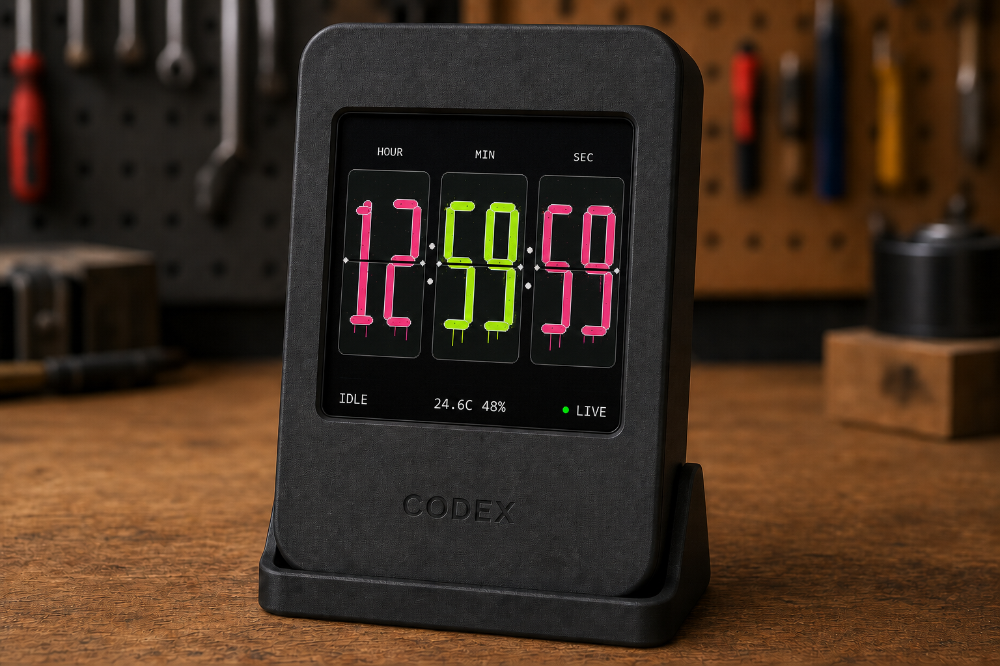
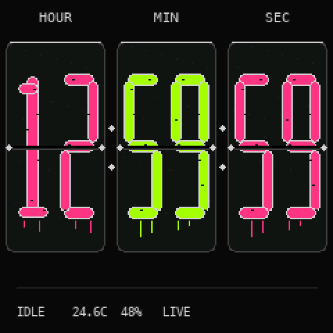
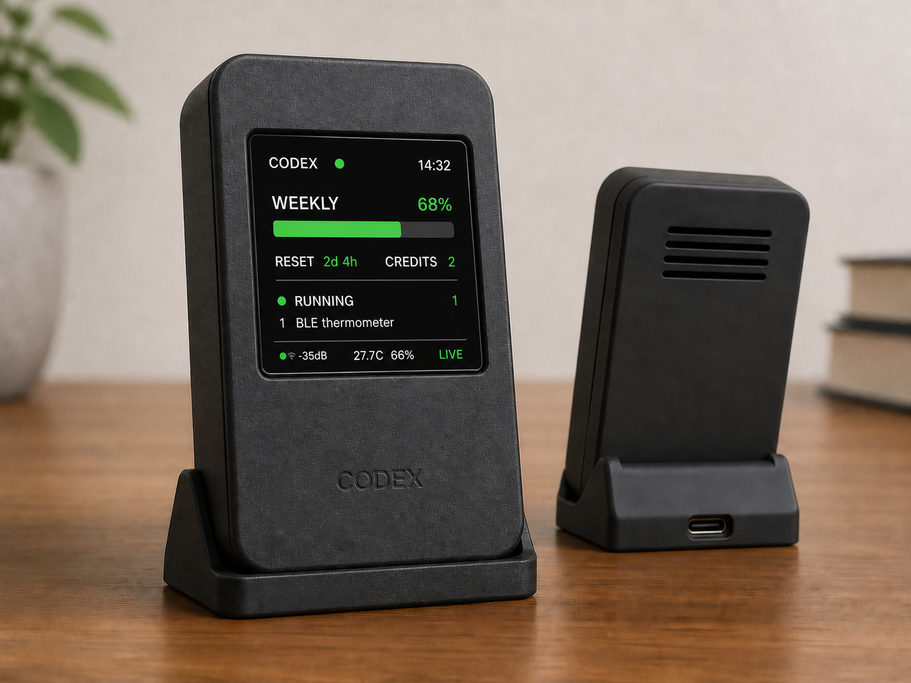
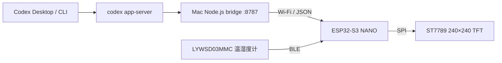

# Codex Usage Widget

[English](README.md) | **简体中文**

用 ESP32-S3 NANO 和 1.54 英寸 ST7789 TFT 制作的桌面 Codex 状态屏：工作时查看额度、任务和温湿度，空闲时切换为 **时／分／秒翻页钟**。



*上图为根据新版界面生成的 AI 产品效果图；下方动画使用固件绘制代码在电脑端生成，两者均不是运行中设备的实拍。*



没有运行中的 Codex 任务时，屏幕自动切换为朋克涂鸦翻页钟；至少 30 秒未取得有效数据且已确认请求失败时，也会进入时钟并标记离线。新鲜数据恢复且有任务运行时，自动恢复额度和任务状态面板。



屏幕显示：

- Codex 周额度使用比例
- 距离周额度重置的剩余时间
- 可用 reset credits
- 当前正在运行的 Codex 任务数量
- 最多两个真实任务标题，支持常用简体中文
- 米家 `LYWSD03MMC` 的温度和湿度
- 当前时间、Wi-Fi 信号强度和数据状态（`LIVE` / `STALE`）
- 时、分、秒三组双位翻页牌，秒牌每秒翻动，进位时对应牌同步翻动
- 约 650ms 的上下半页投影动画、随角度变化的明暗和画面缓冲
- 桥接 HTTP 请求在后台执行，避免请求超时阻塞秒钟
- 无任务时进入空闲钟，持续数据故障时进入离线钟
- 内置 Wi-Fi 配网页面，无需为了更换网络或 Mac 地址重新烧录
- macOS 后台自启动，等待外置项目磁盘与配置的代理就绪
- 可打印外壳与本地 3D 预览器，支持网格拓扑检查、内部装配检查和碰撞演示

本文按全新 macOS 环境编写，从硬件接线到首次显示数据均可逐步复现。项目目前在 ESP32-S3 NANO（16MB Flash、8MB PSRAM）和 240×240 ST7789 SPI 屏幕上验证通过。

## 最近更新

| 范围 | 当前行为 |
| --- | --- |
| 翻页钟 | 由四位时分改为时分秒三组；旧版灰带覆盖效果改为旧上半页收起、新下半页展开。 |
| 动画与请求 | 单次翻页约 650ms，变化牌在缓冲区合成后刷屏；HTTP 请求由后台任务执行。 |
| 校时与进位 | 支持分钟、小时、午夜进位；首次 NTP 校时及时间跳变直接对齐当前时间，不补播错过的秒数。 |
| 离线回退 | 至少 30 秒没有新鲜状态且已确认请求失败后，切换为 `CLOCK / STALE`；无效或过期的 HTTP 200 数据不视为恢复。 |
| 任务识别 | 默认将持续 30 分钟没有 rollout 文件更新的未完成任务判为过期，避免任务永远显示运行中。 |
| 重置倒计时 | NTP 校时后独立刷新，不必等待下一次完整状态重绘。 |
| 外壳与预览器 | v7 后壳修复导轨止挡的非流形坏边；预览器加入拓扑检查和前后壳对齐的 TFT／ESP32 内部装配检查。 |

## 工作原理

ESP32 不直接登录 Codex，也不保存 ChatGPT 凭证。Mac 上的 Node.js 桥接服务启动本机 `codex app-server`，把屏幕需要的信息整理为一个局域网 HTTP 接口；ESP32 默认每 5 秒获取一次，可在配置页调整为 2–60 秒。



桥接服务读取：

- `account/rateLimits/read`：额度窗口、重置时间和 reset credits
- `thread/list`：任务标题、更新时间与本地 rollout 文件
- rollout 生命周期事件：判断任务最后处于运行还是完成状态

Codex CLI 安装和登录方式请参考 [OpenAI Codex CLI 官方说明](https://learn.chatgpt.com/docs/codex/cli)；本项目使用的本地协议见 [Codex App Server 官方说明](https://learn.chatgpt.com/docs/app-server)。

## 显示模式

| 画面 | 触发条件 | 含义 |
| --- | --- | --- |
| 任务面板 · `LIVE` | 有效新鲜数据且 `runningCount > 0` | 显示额度和正在运行的任务。 |
| 翻页钟 · `IDLE / LIVE` | 有效新鲜数据且 `runningCount == 0` | 当前没有任务执行，桥接连接正常。 |
| 原画面 · `STALE` | 请求失败或返回无效／过期数据 | 暂时保留之前的画面并重试。 |
| 翻页钟 · `CLOCK / STALE` | 至少 30 秒无新鲜数据且已确认失败 | 离线回退；已完成首次校时后仍可走时和读取 BLE。 |
| `NO DATA` | 尚未成功获取过状态 | 等待桥接数据，持续故障后进入离线钟。 |
| `SETUP MODE` | 缺少配置、启动时 Wi-Fi 失败，或长按 BOOT 4 秒 | 开放配网热点。 |

**`IDLE` 表示空闲，不表示断线。** 一次回复结束、没有其他任务运行时，设备会进入时钟；开始新任务后，后续刷新会恢复任务面板。桥接刷新与设备轮询各有自己的周期，所以切换不是瞬时发生。

离线回退使用单调计时。正常等待配置的 60 秒轮询间隔不会单独触发离线；如果还未发起下一次轮询或请求仍在等待，实际切换可能晚于 30 秒。

## 一、准备材料

### 硬件

- ESP32-S3 NANO 开发板，已焊接排针
- 1.54 英寸彩色 TFT
  - 驱动芯片：ST7789
  - 接口：SPI
  - 分辨率：240×240
  - 已焊接排针
- 母对母杜邦线 8 根
- 支持数据传输的 USB Type-C 线
- 400 孔面包板，可选；首轮测试可以直接用母对母线连接
- 米家 `LYWSD03MMC` BLE 温湿度计，可选；无需额外接线

> 本项目的引脚和 Flash 设置是针对上述已验证硬件。若屏幕驱动、分辨率、ESP32 型号或 Flash 容量不同，需要调整 `firmware/platformio.ini`。

### 软件

- macOS
- Git
- Node.js 20 或更高版本；项目 `.nvmrc` 推荐 Node.js 22
- npm
- Python 3.12
- [uv](https://docs.astral.sh/uv/)
- Codex CLI，并已完成 ChatGPT 登录
- 一个 2.4 GHz Wi-Fi；Mac 和 ESP32 必须能够在局域网内互相访问

## 二、断电接线

接线时不要连接 USB。确认全部线序后，再把 ESP32 接到电脑。


| ST7789 TFT | ESP32-S3 NANO | 功能 |
| --- | --- | --- |
| `BLK` | `GPIO7` | 背光控制 |
| `CS` | `GPIO10` | SPI 片选 |
| `DC` | `GPIO9` | 数据/命令选择；板上印作 `09` |
| `RES` | `GPIO8` | 屏幕复位；板上印作 `08` |
| `SDA` | `GPIO11` | SPI MOSI，不是 I²C SDA |
| `SCL` | `GPIO12` | SPI 时钟 |
| `VCC` | `3V3` | 3.3V 供电 |
| `GND` | `GND` | 地 |

接线注意事项：

- `VCC` 只接 `3V3`，首轮测试不要接 `5V`。
- 所有线插到底，轻拉确认没有松动。
- TFT 背面标记顺序可能与观看方向相反，按丝印文字逐个确认。
- `SDA` 和 `SCL` 在这块屏幕上属于 SPI，不代表必须使用 I²C 引脚。
- 杜邦线颜色没有电气意义，只需保证两端对应正确。

## 三、取得项目代码

克隆项目：

```bash
git clone https://github.com/datehoer/ai_desktop_widget.git ai_desktop_usage_widget
cd ai_desktop_usage_widget
```

如果拿到的是压缩包，解压后在终端进入包含 `README.md`、`package.json` 和 `firmware` 的目录。

项目主要结构：

```text
ai_desktop_usage_widget/
├── README.md                    # 英文指南
├── README.zh-CN.md              # 中文指南
├── bridge/
│   ├── src/                     # Mac 数据桥和 rollout 任务追踪
│   └── test/                    # Node.js 测试
├── firmware/
│   ├── include/
│   │   ├── flip_clock.h         # 可独立验证的翻页几何与时间进位
│   │   └── secrets.example.h    # 旧固件配置迁移模板
│   ├── src/
│   │   ├── main.cpp             # TFT 界面与后台状态请求
│   │   ├── ble_thermometer.cpp  # BLE 温湿度读取
│   │   ├── device_config.cpp    # NVS 配置和时区
│   │   └── config_portal.cpp    # 热点与局域网配网页面
│   ├── test/                   # 翻页钟原生 C++ 测试
│   └── platformio.ini
├── viewer/                     # 模型／G-code 预览与网格检查
├── output/
│   ├── clock/                  # 固件绘制动画预览
│   ├── enclosure/              # OpenSCAD、STL 和产品效果图
│   └── wiring/                 # 接线图
├── scripts/                    # macOS 后台服务脚本
├── package.json
├── pyproject.toml
└── uv.lock
```

## 四、安装和验证 Codex CLI

先确认命令存在：

```bash
codex --version
```

如果尚未安装，[Codex CLI 官方指南](https://learn.chatgpt.com/docs/codex/cli) 提供的 macOS/Linux 安装命令为：

```bash
curl -fsSL https://chatgpt.com/codex/install.sh | sh
```

首次运行：

```bash
codex
```

按提示选择使用 ChatGPT 登录。完成后退出交互界面，再验证 App Server 能启动：

```bash
codex app-server
```

看到进程保持运行、没有立即报错即可按 `Ctrl+C` 退出。桥接服务稍后会自动启动它，不需要长期手动运行两份。

## 五、准备 Node.js

如果使用 nvm：

```bash
nvm install
nvm use
node --version
npm --version
```

`.nvmrc` 当前固定为 Node.js `22.22.1`。只要 Node.js 版本不低于 20，桥接服务原则上也可运行。

桥接服务只使用 Node.js 内置模块，没有第三方 npm 运行依赖；独立的 `viewer/` 有自己的依赖。先执行测试：

```bash
npm test
```

预期所有测试通过。

## 六、启动 Mac 数据桥

在项目根目录运行：

```bash
npm start
```

终端应输出类似：

```text
Codex Usage Bridge listening on http://0.0.0.0:8787
ESP32 URL: http://192.168.1.100:8787/api/status
```

这里必须使用输出中的局域网 IPv4 地址，实际地址因路由器而异。不要把 `localhost` 或 `127.0.0.1` 填给 ESP32，因为它们在 ESP32 上代表开发板自己。

保持桥接终端运行，并在另一个终端验证：

```bash
curl http://127.0.0.1:8787/healthz
curl http://127.0.0.1:8787/api/status
```

健康检查应返回 JSON；状态接口在首次刷新后应返回包含以下字段的数据：

```json
{
  "ok": true,
  "stale": false,
  "quota": {
    "weekly": {
      "usedPercent": 7,
      "resetsAt": 1780000000
    }
  },
  "resetCredits": 0,
  "runningCount": 1,
  "running": [
    {
      "title": "开发 Codex Usage 桌面面板"
    }
  ]
}
```

数值只是示例，以实际账户返回为准。

### 桥接服务环境变量

| 变量 | 默认值 | 用途 |
| --- | --- | --- |
| `PORT` | `8787` | HTTP 监听端口 |
| `HOST` | `0.0.0.0` | HTTP 监听地址 |
| `REFRESH_MS` | `5000` | 后台刷新间隔，毫秒 |
| `RUNNING_STALE_MS` | `1800000` | rollout 无更新超过此时长后不再计为运行中；设为 `0` 可禁用过期判断 |
| `CODEX_BIN` | `codex` | 自定义 Codex CLI 绝对路径 |
| `DEBUG_CODEX_BRIDGE` | 未启用 | 设为 `1` 后显示 App Server 日志 |

## 七、准备 Python 与 PlatformIO

项目使用 uv 管理 Python 3.12 和固定版本的 PlatformIO 6.1.19：

```bash
uv sync
uv run platformio --version
```

不需要另外创建 Conda 环境；uv 会在项目中创建 `.venv`。

如果首次下载依赖需要本地代理，可以只在当前终端设置：

```bash
export https_proxy=http://127.0.0.1:7890
export http_proxy=http://127.0.0.1:7890
export all_proxy=http://127.0.0.1:7890
export no_proxy=
uv sync
uv run platformio run -d firmware
```

代理地址要改成自己实际运行的代理。依赖下载完成后，局域网访问通常不应经过代理；如遇到 ESP32 接口访问异常，可在新终端重新启动桥接服务。

## 八、准备首次配网信息

Wi-Fi 不再编译进固件。首次烧录后，ESP32 会自动进入内置配网模式。先准备：

- 2.4 GHz Wi-Fi 名称和密码
- `npm start` 打印的 Mac 局域网 URL，例如 `http://192.168.1.100:8787/api/status`
- 所在时区；中国选择“中国标准时间 · 上海（UTC+8）”
- 刷新间隔，允许 2–60 秒，默认 5 秒

配网模式下屏幕会显示：

```text
SETUP MODE
Codex-Widget-XXXX
Password: codexsetup
192.168.4.1
```

首次使用时设备还不知道家中 Wi-Fi 的名称和密码，因此需要临时连接这个热点。系统一般会自动弹出页面；如果没有，手动打开 `http://192.168.4.1/`。填写并保存后设备自动重启，配置保存在 NVS。这个步骤只用于首次配置或原 Wi-Fi 已经无法连接的恢复场景。

已使用旧版 `secrets.h` 的设备会在升级后自动连接一次，并把旧配置迁移进 NVS。全新安装不需要创建 `secrets.h`。

## 九、连接 ESP32 并确认串口

确认接线无误后，用支持数据的 Type-C 线连接电脑。板上亮红灯或绿灯通常只代表供电状态，不代表固件已经正确运行。

列出串口：

```bash
uv run platformio device list
```

macOS 上常见名称：

```text
/dev/cu.usbmodem11201
```

每台电脑和每次插拔后的编号都可能不同，后续命令用自己看到的端口替换示例值。

同时连接多块 ESP32 时，应结合 `device list` 的 USB 序列号和串口启动日志确认目标：本项目会输出 `[boot] Codex Usage Widget`。不要仅凭端口编号或相同的 `USB JTAG/serial debug unit` 名称选择烧录目标。

## 十、编译固件

```bash
uv run platformio run -d firmware
```

首次构建会下载：

- TFT_eSPI
- ArduinoJson
- U8g2_for_TFT_eSPI
- 文泉驿 GB2312 中文字体数据

当前验证构建大约使用：

- RAM（静态）：21.7%
- Flash：26.7%
- 翻页缓冲区运行时另分配约 150 KiB，优先使用 PSRAM

中文字体已经编译进固件，不需要在 ESP32 上单独安装字体文件。翻页缓冲区分配失败时会回退为静态数字更新，并在串口日志中报告。

翻页几何、全天进位和校时跳变可在电脑上验证：

```bash
c++ -std=c++11 -Wall -Wextra -Werror -Ifirmware/include \
  firmware/test/flip_clock_test.cpp -o /tmp/flip-clock-test
/tmp/flip-clock-test
```

## 十一、烧录固件

推荐明确指定串口：

```bash
uv run platformio run -d firmware \
  --target upload \
  --upload-port /dev/cu.usbmodem11201
```

正常情况下不需要按 `RST` 或 `BOOT`。看到以下信息代表烧录完成：

```text
Hash of data verified.
Hard resetting via RTS pin...
[SUCCESS]
```

如果一直停在 `Connecting...`：

1. 按住 `BOOT`。
2. 短按一次 `RST`。
3. 松开 `BOOT`。
4. 重新执行 upload 命令。

项目还保留了 USB-JTAG 恢复环境。普通方式无法烧录时可以尝试：

```bash
uv run platformio run -d firmware \
  -e esp32-s3-nano-jtag \
  --target upload
```

## 十二、查看串口日志

烧录后执行：

```bash
uv run platformio device monitor \
  --port /dev/cu.usbmodem11201 \
  --baud 115200
```

正常日志类似：

```text
[boot] Codex Usage Widget
[boot] initialising TFT on SPI3/HSPI
[boot] TFT ready
[clock] HH:MM:SS flip buffers ready, duration 650ms
[config] loaded from NVS
[wifi] configured SSID found: your-wifi (-42 dBm)
[wifi] connected: 192.168.1.155
[config] bridge: http://192.168.1.100:8787/api/status
[config] hold BOOT for 4s to reconfigure
[display] live status
[task] title: 开发 Codex Usage 桌面面板
[ble] thermometer reader started
```

按 `Ctrl+C` 退出串口监控。退出监控不会停止 ESP32。

## 十三、检查屏幕

首次启动流程通常是：

1. 屏幕背光亮起。
2. 没有有效配置时显示 `SETUP MODE` 并创建临时热点。
3. 在手机/电脑配网页面保存 Wi-Fi 和 Bridge URL。
4. ESP32 重启并连接 Wi-Fi。
5. NTP 同步后顶部时间从 `--:--` 变为当前时间。
6. 获取桥接数据后，有运行中的任务时显示额度与任务，没有任务时显示翻页钟。

界面含义：

| 区域 | 内容 |
| --- | --- |
| 顶部 | `CODEX`、桥接状态点、当前时间 |
| `WEEKLY` | 周额度已使用百分比和进度条 |
| `RESET` | 距离周额度重置的剩余时间 |
| `CREDITS` | 可用 reset credits；接口未提供时显示 `--` |
| `RUNNING` | 当前未完成的 Codex 任务数量 |
| 任务列表 | 最多两个真实任务标题，过长时显示 `...` |
| 底部 | Wi-Fi RSSI、BLE 温湿度和 `LIVE` / `STALE` |
| 空闲翻页钟 | `runningCount` 为 `0` 时显示时、分、秒三组双位翻页牌；秒牌每秒翻动，进位时对应时／分牌同步翻动 |

`LIVE` 表示最近一次桥接数据有效。请求失败时，屏幕短暂保留上一次成功数据并标记 `STALE`；启动后从未成功取得数据时显示 `NO DATA`。从开始请求或最后一次取得有效数据起，连续 30 秒没有新鲜数据且已确认请求失败，就切换为时钟（`CLOCK` / `STALE`），继续联网重试。HTTP 200 中的 `ok=false` 或 `stale=true` 缓存也视为无新鲜数据，不能让旧任务一直留在屏幕上。正常等待下一次定时刷新不会触发离线切换；由于轮询和 HTTP 超时等待，实际检测与切换可能延后。

收到有效数据且任务数为 0 时，时钟显示 `IDLE` / `LIVE`；任务数大于 0 时恢复状态面板。翻页由旧数字上半页收起、新数字下半页展开组成，带角度明暗和中缝，约 650ms 完成一次。动画逐帧在缓冲区合成，桥接 HTTP 请求在后台执行，避免请求超时卡住秒钟；校时跳变直接对齐当前时间，不补播旧秒数。时钟依赖 NTP 完成首次校时，之后断网仍可走时；首次校时前显示占位符。Wi-Fi 首次连接失败时仍进入配网恢复模式。

固件约每分钟扫描一次附近信号最强的 `LYWSD03MMC`，短暂连接并读取温度、湿度和电池后立即断开，避免长期占用连接影响原有米家蓝牙网关。首次读取前底栏显示 `BLE...`；未找到设备时显示 `BLE --`，连接或读取失败时显示 `BLE ERR`。任务面板中，超过三分钟没有新读数时会保留最后一次数据并改为黄色。时钟首次读数前使用 `ROOM ...` 或 `ROOM --` 占位。

## 十四、日常启动顺序

完成首次烧录后，ESP32 会记住固件和 Wi-Fi 配置。日常使用只需要：

1. 给 ESP32 供电。
2. 确保 Mac 和 ESP32 在同一局域网。
3. 在项目目录运行：

   ```bash
   nvm use
   npm start
   ```

4. 保持这个终端和 Mac 处于运行状态。

ESP32 正常联网后会一直在局域网开放配置页。连接同一 Wi-Fi 的电脑或手机可以直接访问：

```text
http://codex-widget.local/
```

如果当前网络不支持 mDNS，也可以使用串口启动日志中 `[config] LAN page:` 后显示的设备 IP，例如 `http://192.168.1.155/`。从局域网页面保存后设备会自动重启。

ESP32 不需要每天重新烧录。正常联网时直接使用上述局域网页面修改 Wi-Fi、密码、Mac 地址、时区或刷新间隔。只有当前 Wi-Fi 已失效、局域网页面无法访问时，才长按 `BOOT` 4 秒进入临时热点恢复模式。修改接线引脚、界面或固件代码时才需要重新烧录。

如果 Mac 的局域网 IP 因 DHCP 发生变化，可直接打开设备的局域网页面更新 Bridge URL。更稳定的做法仍是在路由器中为 Mac 设置 DHCP 地址保留。

### macOS 后台自启动（推荐）

项目提供一个用户级 `launchd` 服务。它会在登录后自动启动 Bridge，进程异常退出时自动重启，不需要一直保留终端窗口。默认把 `http://127.0.0.1:7890` 同时配置为 HTTP、HTTPS 和 ALL proxy，并让 localhost、局域网与 `.local` 地址绕过代理。

安装脚本会把一个很小的启动器复制到 Mac 系统盘。登录后它会等待项目所在磁盘和本地代理就绪，再启动 Bridge。这一点对放在 `/Volumes/...` 外置磁盘中的项目尤其重要，可以避免 launchd 早于磁盘挂载而卡在入口脚本之前。

安装并启动：

```bash
nvm use
npm run service:install
```

如果代理地址不同，可在安装时覆盖：

```bash
CODEX_WIDGET_PROXY='http://127.0.0.1:7891' npm run service:install
```

查看服务与接口状态：

```bash
npm run service:status
```

日志位置：

```text
~/Library/Logs/CodexUsageWidget/bridge.log
~/Library/Logs/CodexUsageWidget/bridge.error.log
```

卸载后台服务：

```bash
npm run service:uninstall
```

安装后台服务后不要再同时运行 `npm start`，否则两者会争用 8787 端口。该服务使用安装时解析到的 Node 和 Codex 绝对路径；以后切换 Node 版本或移动项目目录后，重新执行一次安装命令即可更新。当前安装器默认依赖本地代理；未运行代理时可先使用手动启动方式，否则启动器会等待代理就绪。

## 十五、常见问题

### 1. 屏幕完全不亮

- 检查 `VCC -> 3V3` 和 `GND -> GND`。
- 检查 `BLK -> GPIO7`。
- 确认 USB 线能够供电。
- 用万用表检查时避免让表笔短接相邻引脚。

### 2. 背光亮，但没有画面

- 核对 `CS/DC/RES/SDA/SCL` 五根信号线。
- 确认屏幕驱动是 ST7789、分辨率是 240×240、接口是 SPI。
- 确认使用本项目的 `firmware/platformio.ini`。
- 该硬件需要 `USE_HSPI_PORT=1`，否则 TFT 初始化可能在 ESP32-S3 上崩溃。

### 3. TFT 初始化后重启或出现 `StoreProhibited`

本项目已通过以下编译参数固定使用 SPI3/HSPI：

```ini
-D USE_HSPI_PORT=1
```

不要删除该参数。如果修改了 PlatformIO 环境，确认它仍然生效。

### 4. 找不到串口

- 换一根确定支持数据传输的 USB-C 线。
- 换电脑 USB 端口，避免仅供电 Hub。
- 重新运行 `uv run platformio device list`。
- 尝试 BOOT/RST 下载模式。
- macOS 上选择 `/dev/cu.*` 端口，而不是盲目复用别人的编号。

### 5. Wi-Fi 一直连接失败

- 启动时连接失败后，设备会自动进入 `SETUP MODE`。
- 正常运行时长按 `BOOT` 4 秒也可进入配网页面。
- 核对 SSID 的每一个字符。
- 使用 2.4 GHz 网络。
- 检查密码和大小写。
- 检查路由器是否启用了 AP/client isolation。
- 检查设备数量限制、MAC 过滤和访客网络限制。
- 从串口查看是否出现 `configured SSID found`。

正常联网时优先访问 `http://codex-widget.local/` 或设备的局域网 IP。配网热点密码固定为 `codexsetup`，地址是 `http://192.168.4.1/`；该热点仅在首次配置或恢复模式中开放。

### 6. Wi-Fi 已连接，但显示 `NO DATA`

- 如果已安装后台服务，运行 `npm run service:status`；否则确认 Mac 上的 `npm start` 仍在运行。
- 打开 `http://codex-widget.local/`（或设备 IP）确认 Bridge URL 不是 `localhost` 或 `127.0.0.1`。
- 在 Mac 上打开 `http://<Mac-IP>:8787/api/status`。
- 检查 macOS 防火墙是否阻止 Node.js 接收入站连接。
- 确认 Mac 和 ESP32 不在互相隔离的访客网络。
- 若接口刚启动返回 503，等待首次 Codex 数据刷新后重试。

### 7. 偶尔显示 `STALE`

短暂网络抖动或 Codex App Server 查询变慢时会显示 `STALE`。屏幕会保留最近一次数据并自动重试。桥接接口使用缓存优先，不会让 ESP32 等待慢查询。

如果频繁出现，可查看串口：

```text
[bridge] HTTP -11
```

这通常表示 HTTP 超时。检查 Mac 是否休眠、Wi-Fi 信号、桥接进程和防火墙。

### 8. 显示项目名而不是真实任务名

确认使用最新版固件。最新版直接读取 JSON 的 `title` 字段，不再用项目名回退。串口应输出：

```text
[task] title: 真实任务标题
```

如果接口中的 `title` 正确而串口不正确，重新构建并烧录固件，不要只重启旧固件。

### 9. 中文不显示、乱码或方框

- 确认 PlatformIO 依赖中包含 `U8g2_for_TFT_eSPI`。
- 确认固件使用 `u8g2_font_wqy14_t_gb2312b`。
- 重新执行完整构建和烧录。
- 当前字库覆盖常用 GB2312 简体中文；emoji、繁体和生僻 Unicode 字符可能缺字。

### 10. 时间一直是 `--:--`

时间来自 NTP。检查 Wi-Fi 是否能访问互联网，以及网络是否屏蔽 `pool.ntp.org` 或 `time.cloudflare.com`。时区可在配置页直接选择；中国选择“中国标准时间 · 上海（UTC+8）”。采用夏令时的选项会自动切换。

### 11. `RUNNING` 数量和肉眼观察不一致

桥接服务根据本地 rollout 文件最后一个 `task_started`、`task_complete`、`task_cancelled` 或 `turn_aborted` 事件判断。为避免异常退出留下永久运行状态，仍为 `task_started` 但连续 30 分钟没有文件更新的任务会自动过期；可通过 `RUNNING_STALE_MS` 调整。短时不一致时先等待一个刷新周期，再重启桥接服务确认。

### 12. PlatformIO 下载失败

按“准备 Python 与 PlatformIO”一节临时设置代理。若代理端口不是 `7890`，使用自己的端口。依赖已经下载后，可取消代理再编译。

### 13. 为什么回复结束后显示 `IDLE`

这是没有运行任务时的正常状态。`IDLE / LIVE` 表示桥接连接正常、当前空闲；只有 `CLOCK / STALE` 才是持续数据故障后的时钟。开始新任务后，等待桥接刷新和设备轮询即可恢复任务面板。

### 14. 秒数变化但没有翻页动画

检查串口是否出现 `[clock] HH:MM:SS flip buffers ready, duration 650ms`。内存分配失败时会使用静态回退；首次校时和时间跳变也会直接切换到准确时间。如果仍显示旧版四位时分界面，需要重新构建并烧录固件。

## 十六、安全说明

- Wi-Fi 密码保存在 ESP32 的 NVS；默认没有启用 Flash Encryption，因此能物理读取设备 Flash 的人理论上可以取得密码。
- 配置页面不会回显已保存的 Wi-Fi 密码。
- 旧设备可通过被 Git 忽略的 `firmware/include/secrets.h` 完成一次迁移；不要提交真实 `secrets.h`。
- 不要把串口日志中的敏感内容或 ChatGPT 登录文件提交到公开仓库。
- ESP32 不保存 ChatGPT 登录令牌；登录状态只存在于运行 Codex 的 Mac。
- 桥接服务监听局域网所有网卡且没有登录验证；桥接与设备局域网配置页都只应用于可信局域网。
- 不要把 8787 端口映射到公网。

## 十七、开发与验证

修改桥接代码后：

```bash
npm test
```

修改固件后：

```bash
c++ -std=c++11 -Wall -Wextra -Werror -Ifirmware/include \
  firmware/test/flip_clock_test.cpp -o /tmp/flip-clock-test
/tmp/flip-clock-test
uv run platformio run -d firmware
uv run platformio run -d firmware \
  --target upload \
  --upload-port /dev/cu.usbmodem11201
```

修改桥接代码后，后台服务用户可重新运行 `npm run service:install` 以重启并更新配置；手动运行用户需重启 `npm start`。修改固件代码后必须重新烧录。

时分秒版本已通过固件编译、翻页原生测试和 6 项桥接测试，并烧录到确认身份的项目设备。启动日志确认翻页缓冲区就绪，实时任务数据恢复。GIF 为电脑端绘制预览，实体 TFT 的最终观感仍受实际刷屏表现影响。

## 当前限制

- 已针对 macOS 和一块具体的 ESP32-S3 NANO 验证；Windows/Linux 的串口名和自启动方式不同。
- Mac 必须开机并运行桥接服务。
- Mac IP 改变后需要通过配网页面更新 Bridge URL；当前版本尚未实现 mDNS 自动发现。
- 桥接检查最近更新的 30 个未归档任务，统计其中检测到的运行任务，接口最多返回 4 个标题，屏幕最多显示 2 个。
- 中文字体覆盖 GB2312 常用简体字，不覆盖所有 Unicode。
- Codex App Server 或本地 rollout 格式如果将来改变，桥接解析可能需要同步更新。

## 十八、外壳与本地 3D 预览器

外壳采用黑色前框、烟灰透明 PETG 后壳和后倾 15° 黑色底座。尺寸、打印参数、装配说明和 OpenSCAD 导出命令见 [外壳指南](output/enclosure/README.md)。

当前版本文件：

| 零件 | 文件 |
| --- | --- |
| 加宽前框 | [front-black-v5-wide.stl](output/enclosure/front-black-v5-wide.stl) |
| 修复导轨非流形问题的后壳 | [back-smoke-petg-v7-manifold.stl](output/enclosure/back-smoke-petg-v7-manifold.stl) |
| 匹配的加宽底座 | [stand-black-v5-wide.stl](output/enclosure/stand-black-v5-wide.stl) |
| 参数化源文件 | [codex_widget_enclosure.scad](output/enclosure/codex_widget_enclosure.scad) |

v7 后壳通过 0.4 mm 实体搭接连接导轨与止挡，消除非流形坏边。预览器内部装配模式会载入当前前后壳与电子元件占位模型；当前深度计算显示 **剩余余量 0 mm**，仍需结合实际接头、线缆弯折和装配样条确认，不能仅凭效果图判定实体装配已验证。

`viewer/` 是独立的浏览器端预览器，文件只在本机解析，不会上传。当前支持：

- STL、3MF、OBJ、AMF、PLY、STEP/STP 模型导入
- 多个独立零件连续添加、自动平铺和零件列表选择
- 在 3D 画布直接点击选择零件，并用三轴操纵器移动、旋转和缩放
- 世界/局部坐标切换，1 mm、15°、0.1 倍变换吸附，以及 W / E / R / Q 快捷键
- XYZ 精确数值编辑，零件居中、贴合热床、复制、复位、删除和清空装配
- G-code 打印路径和逐层查看
- 尺寸、三角面数和网格数量统计
- 哑光塑料、半透明 PETG 和金属外观
- Rapier 重力、摩擦、打印床及其他装配零件碰撞演示
- 后台网格检查：独立壳体、非流形坏边、孔洞、面方向冲突、重复三角面和退化三角面
- 前后壳对齐的内部装配检查，以及 TFT／ESP32 占位模型和 G-code 示例

拓扑检查有助于发现网格缺陷，不能替代切片器对薄壁、悬垂和材料收缩的检查。

首次安装依赖：

```bash
npm run viewer:install
```

启动开发服务器：

```bash
npm run viewer:dev
```

然后打开 `http://localhost:4173/`。生产构建和本地预览分别使用：

```bash
npm run viewer:build
npm run viewer:preview
```

预览器基于 Online3DViewer、GCode Preview、Three.js 和 Rapier。生产构建会把内部装配检查使用的两个前后壳 STL 文件复制进 `viewer/dist/assets/`，因此构建产物体积会包含这些模型。
